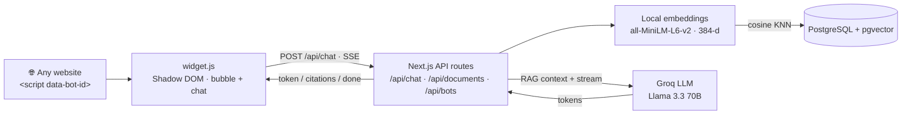

# AI Support Widget

> An embeddable AI support chat. Drop one `<script>` tag on any website → a chat
> bubble appears in the corner → the bot answers visitors from the company's docs,
> with citations and streaming responses.

Built as a single **Next.js** app (frontend + API routes), backed by **PostgreSQL +
pgvector**. Embeddings run locally (no key); answers come from **Groq** with
**BYOK** (bring your own key). The widget renders inside a **Shadow DOM**, so its
styles never clash with the host site.

**Live demo:** coming soon · **Run it locally:** see [Run locally](#run-locally).

<!-- Replace docs/widget.svg with a real screenshot/GIF of the widget on a site -->
<p align="center">
  
</p>

---

## What's inside

1. **`public/widget.js`** — a self-contained embeddable script. Renders a chat
   bubble + window in a **Shadow DOM**, streams answers over SSE, shows citations.
   Embed with `<script src=".../widget.js" data-bot-id="..."></script>`.
2. **Dashboard** (Next.js) — create a bot, upload docs (PDF/TXT/MD → chunked →
   embedded → pgvector), copy the embed snippet, preview-chat the bot, read
   conversation logs, set your Groq key.
3. **API routes** — `/api/chat` (RAG + Groq + SSE + citations), `/api/documents`,
   `/api/bots`.
4. **Demo page** (`/demo`) — a fake "company site" with the widget already embedded,
   so you can see exactly how it looks for a real visitor.

---

## Architecture



**RAG flow:** question → embed → top-k cosine search in pgvector → prompt Groq with
the retrieved context → stream the answer back token by token → attach citations.

---

## Run locally

You need **Docker** (for Postgres), **Node 18+**, and a free **Groq API key**.

```bash
# 1. Clone + install
git clone https://github.com/batyrq/ai-support-widget.git
cd ai-support-widget
npm install

# 2. Start Postgres (only the DB runs in Docker; Next.js runs via npm)
cp .env.example .env
docker compose up -d postgres

# 3. Apply schema + seed a demo bot with documents
npx prisma migrate deploy
npm run seed

# 4. Run the app
npm run dev
# Dashboard → http://localhost:3000
# Demo site → http://localhost:3000/demo
```

### Making the bot answer

There are **two ways** the Groq key reaches the server — by design, because an
embeddable widget on a public page can't safely carry a secret:

| Where | How the key is provided |
|-------|-------------------------|
| **Dashboard preview chat** | You paste your key in the dashboard → stored in your browser (`localStorage`) → sent per request in the `x-groq-key` header. **BYOK.** |
| **Embedded widget / demo page** | The widget sends **no** key. The server uses `GROQ_API_KEY` from `.env`. So to see the demo widget answer, set `GROQ_API_KEY` in `.env` and restart. |

In both cases the key is **never stored in the database or logged**.

---

## Embed on your site

```html
<script src="http://localhost:3000/widget.js" data-bot-id="YOUR_BOT_ID"></script>
```

Copy the ready-to-paste snippet (with the real bot id) from the bot's page in the
dashboard.

---

## How it works

**RAG** (`src/lib/retrieval.ts`, `src/lib/embeddings.ts`)
Files are chunked (~900 chars, 150 overlap), embedded locally to 384-d vectors, and
stored in a `vector(384)` column. Search is cosine KNN (`embedding <=> query`) with
an HNSW index.

**Widget embedding** (`public/widget.js`)
The script reads `data-bot-id` from its own tag, derives the API origin from its
`src` (so it works cross-origin), and talks to `/api/chat` (CORS-enabled). A visitor
id + conversation id keep a single dialog grouped in the logs.

**Shadow DOM** (`public/widget.js`)
The whole UI lives under `host.attachShadow({ mode: 'open' })` with its styles
scoped inside the shadow root — the host site's CSS can't leak in, and the widget's
CSS can't leak out. That's what makes it safe to drop onto *any* site.

**BYOK** (`src/lib/groq.ts`, `src/app/api/chat/route.ts`)
The key is resolved from the `x-groq-key` header (preferred) or the server
`GROQ_API_KEY` fallback, used only to call Groq, and never persisted or logged.

---

## Tech stack

| Layer       | Tech                                                  |
|-------------|-------------------------------------------------------|
| App         | Next.js 14 (App Router) · TypeScript · Tailwind       |
| Database    | PostgreSQL 16 · pgvector (HNSW, cosine)               |
| LLM         | Groq — Llama 3.3 70B (BYOK)                            |
| Embeddings  | `@xenova/transformers` · all-MiniLM-L6-v2 · 384-d · local |
| ORM         | Prisma 5                                               |
| Widget      | Vanilla JS · Shadow DOM (zero host-site conflicts)    |

---

## Project structure

```
ai-support-widget/
├── docker-compose.yml         # postgres + pgvector only
├── prisma/                    # schema, migration, seed
├── public/widget.js           # embeddable Shadow-DOM widget
└── src/
    ├── app/
    │   ├── page.tsx           # dashboard: bots list
    │   ├── bots/[id]/         # bot: docs, snippet, preview chat, logs
    │   ├── demo/              # fake company site with the widget
    │   └── api/               # chat (SSE) · documents · bots
    └── lib/                   # embeddings · chunking · retrieval · groq
```

## License

MIT
