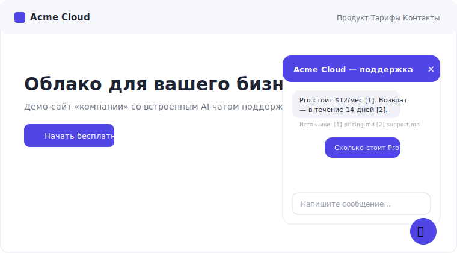
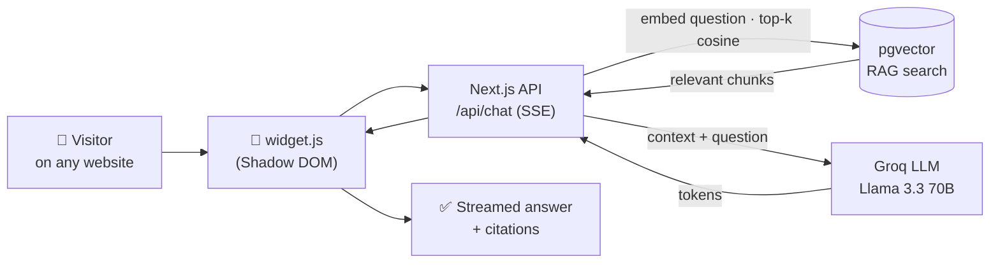

# AI Support Widget

### Embeddable AI support widget — drop one `<script>` tag on any site.

A chat bubble appears in the corner, and the bot answers your visitors from your
own docs — streamed, with citations. One Next.js app, Postgres + pgvector for
search, Groq for answers, and a **Shadow DOM** widget that never clashes with the
host site's styles.

<!-- ▶ Replace docs/widget.svg with your recorded demo GIF (e.g. docs/demo.gif from /demo) -->
<p align="center">
  
  <br>
  <sub><b>Embeddable AI support widget — drop one <code>&lt;script&gt;</code> tag on any site.</b></sub>
</p>

> **Live demo:** coming soon.

---

## How it works

**1. Load your docs** → in the dashboard, create a bot and upload PDF / TXT / MD.
They're chunked, embedded locally (384-d), and stored in pgvector.

**2. Get your `<script>` snippet** → copy a one-line embed snippet with your bot id
and paste it on any website.

**3. The widget answers visitors** → the bubble streams answers grounded in your
docs, each with citations to the source files.



---

## Embed on your site

Paste this before `</body>` on any page — that's the whole integration:

```html
<script src="https://your-domain.com/widget.js" data-bot-id="YOUR_BOT_ID"></script>
```

- `data-bot-id` selects which bot (and which knowledge base) answers.
- The widget figures out the API URL from its own `src`, so it works cross-origin.
- The dashboard gives you the exact snippet with the real bot id, ready to copy.

---

## Run locally

You need **Docker** (for Postgres), **Node 18+**, and a free **Groq API key**.

```bash
git clone https://github.com/batyrq/ai-support-widget.git
cd ai-support-widget
npm install

cp .env.example .env
docker compose up -d postgres      # only the DB runs in Docker

npx prisma migrate deploy          # schema + CREATE EXTENSION vector
npm run seed                       # demo bot "Acme Cloud" with docs

npm run dev
# Dashboard → http://localhost:3000
# Demo site → http://localhost:3000/demo   (fake company site with the widget)
```

**Live demo:** coming soon.

### Where the Groq key comes from (BYOK)

An embeddable widget on a public page can't safely carry a secret, so:

| Context | Key source |
|---------|-----------|
| Dashboard preview chat | Your key, pasted in the dashboard → stored in your browser → sent as `x-groq-key`. |
| Embedded widget / `/demo` | No key from the page — the server uses `GROQ_API_KEY` from `.env`. Set it to make the demo widget answer. |

The key is **never stored in the database or logged**.

---

## Features

- 🧩 **One-tag embed** — `<script ... data-bot-id>`, nothing else.
- 🛡️ **Shadow DOM** — fully isolated styles; safe on any site.
- 📚 **RAG with citations** — answers cite the exact source documents.
- ⚡ **Streaming** — token-by-token over SSE.
- 🔑 **BYOK** — bring your own Groq key; never persisted.
- 🧠 **Local embeddings** — no embedding API key needed.
- 🗂️ **Dashboard** — bots, doc upload, embed snippet, preview chat, conversation logs.

---

## Tech stack

| Layer       | Tech                                                  |
|-------------|-------------------------------------------------------|
| App         | Next.js 14 (App Router) · TypeScript · Tailwind       |
| Database    | PostgreSQL 16 · pgvector (HNSW, cosine)               |
| LLM         | Groq — Llama 3.3 70B (BYOK)                            |
| Embeddings  | `@xenova/transformers` · all-MiniLM-L6-v2 · 384-d · local |
| ORM         | Prisma 5                                               |
| Widget      | Vanilla JS · Shadow DOM (zero host-site conflicts)    |

---

## Under the hood

- **RAG** (`src/lib/retrieval.ts`, `src/lib/embeddings.ts`) — chunk (~900 chars,
  150 overlap) → 384-d embedding → `vector(384)` column → cosine KNN with an HNSW index.
- **Widget** (`public/widget.js`) — reads `data-bot-id`, derives the API origin from
  its `src`, talks to the CORS-enabled `/api/chat`, keeps a visitor + conversation id.
- **Shadow DOM** — the whole UI lives under `attachShadow({ mode: 'open' })` with
  scoped styles, so host CSS can't leak in and widget CSS can't leak out.
- **BYOK** (`src/lib/groq.ts`) — key from `x-groq-key` header or `GROQ_API_KEY`
  fallback; used only to call Groq, never persisted or logged.

```
ai-support-widget/
├── docker-compose.yml         # postgres + pgvector only
├── prisma/                    # schema, migration, seed (demo bot)
├── public/widget.js           # embeddable Shadow-DOM widget
└── src/
    ├── app/
    │   ├── page.tsx           # dashboard: bots
    │   ├── bots/[id]/         # docs, snippet, preview chat, logs
    │   ├── demo/              # fake company site with the widget
    │   └── api/               # chat (SSE) · documents · bots
    └── lib/                   # embeddings · chunking · retrieval · groq
```

## License

MIT
